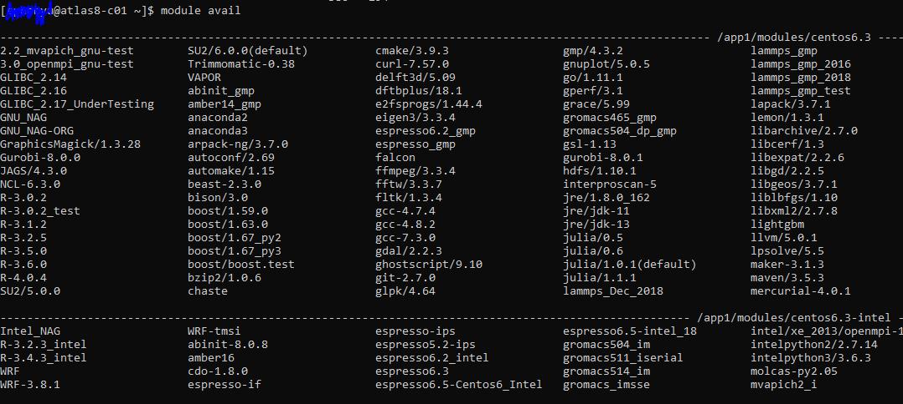

```{r setup, include=FALSE}
knitr::opts_chunk$set(echo = TRUE)
```

This tutorial hopes to give readers a brief overview of what High Performance Computing (HPC) is and
how to get your `R project` started running in HPC at `National University of Singapore on campus`.

# Introduction

## What is HPC
HPC is the abbreviation for High Performance Computing. A computer cluster is a set of connected 
computers (nodes) that work together as if they are a single (much more powerful) machine. You can
find more details at this [website](https://www.acecloudhosting.com/blog/high-performance-computing/).

The following figure is an example of High Performance Computing Architecture.


## What is PBS
PBS stands for Portable Bash System which gives easy to understand message when you check pending 
reasons of your batch jobs.

## Why we need a scheduler

Without a scheduler, an HPC cluster would just be a bunch of servers with different jobs interfering
with each other. When you have a large cluster and multiple users, each user doesn’t know which 
compute nodes and CPU cores to use, nor how much resources are available on each node. 
To solve this, cluster batch control systems are used to manage jobs on the system using HPC 
Schedulers. They are essential for sequentially queueing jobs, assigning priorities, distributing, 
parallelizing, suspending, killing or otherwise controlling jobs cluster-wide. You can find more
details at this [website](https://www.aspsys.com/solutions/software-solutions/hpc-schedulers/).

## Basic PBS commands

* `qsub file.txt` Submit your job script
* `qstat -x` Check your submission history and the progress of each job
* `qstat -q` Check available queue
* `qdel job_number` Delete your submitted job

You can have a look at this [website](https://nusit.nus.edu.sg/services/hpc-newsletter/pbs-job-scheduler/)
wrote by Junhong Wang. 

# Get started

Before getting started, you need to register your NUS HPC account via this [website](https://nusit.nus.edu.sg/services/hpc/getting-started-hpc/register-for-hpc/). Your account
will be activated approximately within 1 hour after your registration. 

Next, you can login to your account by typing `ssh user_id@atlas8` in the command prompt. `ssh`
stands for Secure Shell, which is a network communication protocol that enables two computers to 
communicate and share data. This command will fail if you are not connected to  NUS WIFI. You can
find how to connect to NUS HPC outside NUS or via other methods at this [website](https://nusit.nus.edu.sg/services/getting-started/introductory-guide-for-new-hpc-users/),
or approach [nTouch](ntouch.nus.edu.sg) for help. NUS IT staff are very approachable and responsible.
Usually your query will be replied within one week.

`atlas8` is one of the host names. You can login other hosts as well. You may refer to available
host's name via this [website](https://nusit.nus.edu.sg/services/getting-started/introductory-guide-for-new-hpc-users/).
In addition, you can use NUS `cloud service` by typing `ssh user_id@hpclogin` in the command prompt.

## Create R Environment

After you have access to HPC, you can type `module avail` to see available applications. You can take
a look at Available Applications at NUS HPC. 



Next, you can create your R environment by using miniconda and install all the libraries you need for
your R projects.

```{r, eval=FALSE}
module load miniconda # Load miniconda
conda create -n covidm r-essentials r-base # Create a new environment called covidm and install essential r packages
source activate covidm # activate covidm environment (switch from base to covidm)
conda list # check the installed packages in your current environment
conda install -c conda-forge Rcpp # Install R-packages to your current environment
conda list # check whether Rcpp is successfully installed
```

## File transfer commands

```{r, eval=FALSE}
scp -r C:/Users/your_name/Desktop/R_project_folder user_id@atlas8/home/svu/user_id/ # copy your
# R projects that stored in your desktop, R_project folder to HPC
```

## Creat an exmaple R job script

You can type `vim my_example.txt` to create a blank `txt` file in HPC. Vim is an editor to create or
edit a txt file. You can find vim basic commands at at this [website](https://coderwall.com/p/adv71w/basic-vim-commands-for-getting-started).

In the file you created just now, you can write the following commands (bash commands).

```{r, eval=FALSE}
#!/bin/bash
#PBS -q parallel12  # You can choose other PBS queue, I use parellel12 because my project did parallel computing
#PBS -l select=1:ncpus=12:mpiprocs=12 #If you change queue, this should adjust accordingly 
#PBS -j oe
#PBS -N covidm-fit1 # Project name
cd $PBS_O_WORKDIR

source /etc/profile.d/modules.sh
module load icu/58.3
module load miniconda
source activate covidm

Rscript ./covidm-palestine/codes/main.R &> ./output.txt & # Run main.R & main1.R in parallel
Rscript ./covidm-palestine/codes/main1.R &> ./output1.txt

exit 0
```

This [website](https://linuxconfig.org/bash-scripting-tutorial-for-beginners) is a great tutorial for beginner to learn Bash commands and shell scripting. In short, `Bash` is a command processor that typically runs in a text window where the user types commands that cause actions. `Shell` is a macro processor which allows for an interactive or non-interactive command execution.`Scripting` allows for an automatic commands execution that would otherwise be executed interactively one-by-one. 

### IMPORTANT!

One thing to take note is that, you can store the program error and output by using this command `%>`. Then the programming error and output will be saved in the `output.txt`. This technique is very useful in debugging.

Finally, you can type `qsub my_example.txt` to run your jobs in HPC. You can logout HPC by typing `exit`. 


